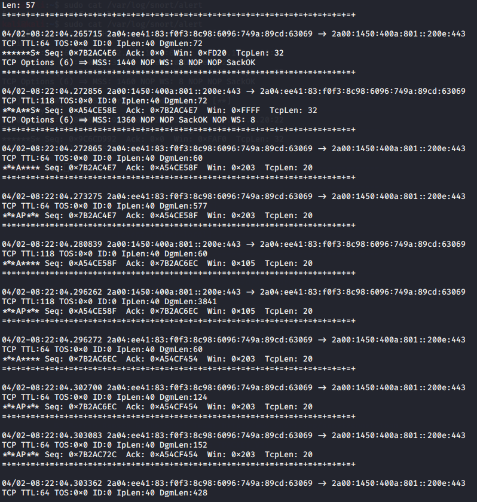

# Teaching-HEIGVD-SRX-2020-Laboratoire-IDS

**Ce travail de laboratoire est à faire en équipes de 2 personnes** (oui... en remote...). Je vous laisse vous débrouiller ;-)

**ATTENTION : Commencez par créer un Fork de ce repo et travaillez sur votre fork.**

Clonez le repo sur votre machine. Vous pouvez répondre aux questions en modifiant directement votre clone du README.md ou avec un fichier pdf que vous pourrez uploader sur votre fork.

**Le rendu consiste simplement à répondre à toutes les questions clairement identifiées dans le text avec la mention "Question" et à les accompagner avec des captures. Le rendu doit se faire par une "pull request". Envoyer également le hash du dernier commit et votre username GitHub par email au professeur et à l'assistant**

## Table de matières

[Introduction](#introduction)

[Echéance](#echéance)

[Configuration du réseau](#configuration-du-réseau-sur-virtualbox)

[Installation de Snort](#installation-de-snort-sur-linux)

[Essayer Snort](#essayer-snort)

[Utilisation comme IDS](#utilisation-comme-un-ids)

[Ecriture de règles](#ecriture-de-règles)

[Travail à effectuer](#exercises)


## Echéance 

Ce travail devra être rendu le dimanche après la fin de la 2ème séance de laboratoire, soit au plus tard, **le 6 avril 2020, à 23h59.**


## Introduction

Dans ce travail de laboratoire, vous allez explorer un système de detection contre les intrusions (IDS) dont l'utilisation es très répandue grace au fait qu'il est gratuit et open source. Il s'appelle [Snort](https://www.snort.org). Il existe des versions de Snort pour Linux et pour Windows.

### Les systèmes de detection d'intrusion

Un IDS peut "écouter" tout le traffic de la partie du réseau où il est installé. Sur la base d'une liste de règles, il déclenche des actions sur des paquets qui correspondent à la description de la règle.

Un exemple de règle pourrait être, en language commun : "donner une alerte pour tous les paquets envoyés par le port http à un serveur web dans le réseau, qui contiennent le string 'cmd.exe'". En on peut trouver des règles très similaires dans les règles par défaut de Snort. Elles permettent de détecter, par exemple, si un attaquant essaie d'executer un shell de commandes sur un serveur Web tournant sur Windows. On verra plus tard à quoi ressemblent ces règles.

Snort est un IDS très puissant. Il est gratuit pour l'utilisation personnelle et en entreprise, où il est très utilisé aussi pour la simple raison qu'il est l'un des plus efficaces systèmes IDS.

Snort peut être exécuté comme un logiciel indépendant sur une machine ou comme un service qui tourne après chaque démarrage. Si vous voulez qu'il protège votre réseau, fonctionnant comme un IPS, il faudra l'installer "in-line" avec votre connexion Internet. 

Par exemple, pour une petite entreprise avec un accès Internet avec un modem simple et un switch interconnectant une dizaine d'ordinateurs de bureau, il faudra utiliser une nouvelle machine executant Snort et placée entre le modem et le switch. 


## Matériel

Vous avez besoin de votre ordinateur avec VirtualBox et une VM Kali Linux. Vous trouverez un fichier OVA pour la dernière version de Kali sur `//eistore1/cours/iict/Laboratoires/SRX/Kali` si vous en avez besoin.


## Configuration du réseau sur VirtualBox

Votre VM fonctionnera comme IDS pour "protéger" votre machine hôte (par exemple, si vous faites tourner VirtualBox sur une machine Windows, Snort sera utilisé pour capturer le trafic de Windows vers l'Internet).

Pour cela, il faudra configurer une réseau de la VM en mode "bridge" et activer l'option "Promiscuous Mode" dans les paramètres avancés de l'interface. Le mode bridge dans l'école ne vous permet pas d'accéder à l'Internet depuis votre VM. Vous pouvez donc rajouter une deuxième interface réseau à votre Kali configurée comme NAT. La connexion Internet est indispensable pour installer Snort mais pas vraiment nécessaire pour les manipulations du travail pratique.

Pour les captures avec Snort, assurez-vous de toujours indiquer la bonne interface dans la ligne de commandes, donc, l'interface configurée en mode promiscuous.


## Installation de Snort sur Linux

On va installer Snort sur Kali Linux. Si vous avez déjà une VM Kali, vous pouvez l'utiliser. Sinon, vous avez la possibilité de copier celle sur `eistore`.

La manière la plus simple c'est de d'installer Snort en ligne de commandes. Il suffit d'utiliser la commande suivante :

```
sudo apt update && apt install snort
```

Ceci télécharge et installe la version la plus récente de Snort.

Vers la fin de l'installation, on vous demande de fournir l'adresse de votre réseau HOME. Il s'agit du réseau que vous voulez protéger. Cela sert à configurer certaines variables pour Snort. Pour les manipulations de ce laboratoire, vous pouvez donner n'importe quelle adresse comme réponse.


## Essayer Snort

Une fois installé, vous pouvez lancer Snort comme un simple "sniffer". Pourtant, ceci capture tous les paquets, ce qui peut produire des fichiers de capture énormes si vous demandez de les journaliser. Il est beaucoup plus efficace d'utiliser des règles pour définir quel type de trafic est intéressant et laisser Snort ignorer le reste.

Snort se comporte de différentes manières en fonction des options que vous passez en ligne de commande au démarrage. Vous pouvez voir la grande liste d'options avec la commande suivante :

```
snort --help
```

On va commencer par observer tout simplement les entêtes des paquets IP utilisant la commande :

```
snort -v -i eth0
```

**ATTENTION : assurez-vous de bien choisir l'interface qui se trouve en mode bridge/promiscuous. Elle n'est peut-être pas eth0 chez-vous!**

Snort s'execute donc et montre sur l'écran tous les entêtes des paquets IP qui traversent l'interface eth0. Cette interface est connectée à l'interface réseau de votre machine hôte à travers le bridge de VirtualBox.

Pour arrêter Snort, il suffit d'utiliser `CTRL-C` (**attention** : il peut arriver de temps à autres que snort ne réponde pas correctement au signal d'arrêt. Dans ce cas-là, il faudra utiliser `kill` pour arrêter le process).

## Utilisation comme un IDS

Pour enregistrer seulement les alertes et pas tout le trafic, on execute Snort en mode IDS. Il faudra donc spécifier un fichier contenant des règles. 

Il faut noter que `/etc/snort/snort.config` contient déjà des références aux fichiers de règles disponibles avec l'installation par défaut. Si on veut tester Snort avec des règles simples, on peut créer un fichier de config personnalisé (par exemple `mysnort.conf`) et importer un seul fichier de règles utilisant la directive "include".

Les fichiers de règles sont normalement stockes dans le repertoire `/etc/snort/rules/`, mais en fait un fichier de config et les fichiers de règles peuvent se trouver dans n'importe quel repertoire. 

Par exemple, créez un fichier de config `mysnort.conf` dans le repertoire `/etc/snort` avec le contenu suivant :

```
include /etc/snort/rules/icmp2.rules
```

Ensuite, créez le fichier de règles `icmp2.rules` dans le repertoire `/etc/snort/rules/` et rajoutez dans ce fichier le contenu suivant :

`alert icmp any any -> any any (msg:"ICMP Packet"; sid:4000001; rev:3;)`

On peut maintenant executer la commande :

```
snort -c /etc/snort/mysnort.conf
```

Vous pouvez maintenant faire quelques pings depuis votre hôte et regarder les résultas dans le fichier d'alertes contenu dans le repertoire `/var/log/snort/`. 


## Ecriture de règles

Snort permet l'écriture de règles qui décrivent des tentatives de exploitation de vulnérabilités bien connues. Les règles Snort prennent en charge à la fois, l'analyse de protocoles et la recherche et identification de contenu.

Il y a deux principes de base à respecter :

* Une règle doit être entièrement contenue dans une seule ligne
* Les règles sont divisées en deux sections logiques : (1) l'entête et (2) les options.

L'entête de la règle contient l'action de la règle, le protocole, les adresses source et destination, et les ports source et destination.

L'option contient des messages d'alerte et de l'information concernant les parties du paquet dont le contenu doit être analysé. Par exemple:

```
alert tcp any any -> 192.168.1.0/24 111 (content:"|00 01 86 a5|"; msg: "mountd access";)
```

Cette règle décrit une alerte générée quand Snort trouve un paquet avec tous les attributs suivants :

* C'est un paquet TCP
* Emis depuis n'importe quelle adresse et depuis n'importe quel port
* A destination du réseau identifié par l'adresse 192.168.1.0/24 sur le port 111

Le text jusqu'au premier parenthèse est l'entête de la règle. 

```
alert tcp any any -> 192.168.1.0/24 111
```

Les parties entre parenthèses sont les options de la règle:

```
(content:"|00 01 86 a5|"; msg: "mountd access";)
```

Les options peuvent apparaître une ou plusieurs fois. Par exemple :

```
alert tcp any any -> any 21 (content:"site exec"; content:"%"; msg:"site
exec buffer overflow attempt";)
```

La clé "content" apparait deux fois parce que les deux strings qui doivent être détectés n'apparaissent pas concaténés dans le paquet mais à des endroits différents. Pour que la règle soit déclenchée, il faut que le paquet contienne **les deux strings** "site exec" et "%". 

Les éléments dans les options d'une règle sont traitées comme un AND logique. La liste complète de règles sont traitées comme une succession de OR.

## Informations de base pour le règles

### Actions :

```
alert tcp any any -> any any (msg:"My Name!"; content:"Skon"; sid:1000001; rev:1;)
```

L'entête contient l'information qui décrit le "qui", le "où" et le "quoi" du paquet. Ça décrit aussi ce qui doit arriver quand un paquet correspond à tous les contenus dans la règle.

Le premier champ dans le règle c'est l'action. L'action dit à Snort ce qui doit être fait quand il trouve un paquet qui correspond à la règle. Il y a six actions :

* alert - générer une alerte et écrire le paquet dans le journal
* log - écrire le paquet dans le journal
* pass - ignorer le paquet
* drop - bloquer le paquet et l'ajouter au journal
* reject - bloquer le paquet, l'ajouter au journal et envoyer un `TCP reset` si le protocole est TCP ou un `ICMP port unreachable` si le protocole est UDP
* sdrop - bloquer le paquet sans écriture dans le journal

### Protocoles :

Le champ suivant c'est le protocole. Il y a trois protocoles IP qui peuvent être analysez par Snort : TCP, UDP et ICMP.


### Adresses IP :

La section suivante traite les adresses IP et les numéros de port. Le mot `any` peut être utilisé pour définir "n'import quelle adresse". On peut utiliser l'adresse d'une seule machine ou un block avec la notation CIDR. 

Un opérateur de négation peut être appliqué aux adresses IP. Cet opérateur indique à Snort d'identifier toutes les adresses IP sauf celle indiquée. L'opérateur de négation est le `!`.

Par exemple, la règle du premier exemple peut être modifiée pour alerter pour le trafic dont l'origine est à l'extérieur du réseau :

```
alert tcp !192.168.1.0/24 any -> 192.168.1.0/24 111
(content: "|00 01 86 a5|"; msg: "external mountd access";)
```

### Numéros de Port :

Les ports peuvent être spécifiés de différentes manières, y-compris `any`, une définition numérique unique, une plage de ports ou une négation.

Les plages de ports utilisent l'opérateur `:`, qui peut être utilisé de différentes manières aussi :

```
log udp any any -> 192.168.1.0/24 1:1024
```

Journaliser le traffic UDP venant d'un port compris entre 1 et 1024.

--

```
log tcp any any -> 192.168.1.0/24 :6000
```

Journaliser le traffic TCP venant d'un port plus bas ou égal à 6000.

--

```
log tcp any :1024 -> 192.168.1.0/24 500:
```

Journaliser le traffic TCP venant d'un port privilégié (bien connu) plus grand ou égal à 500 mais jusqu'au port 1024.


### Opérateur de direction

L'opérateur de direction `->`indique l'orientation ou la "direction" du trafique. 

Il y a aussi un opérateur bidirectionnel, indiqué avec le symbole `<>`, utile pour analyser les deux côtés de la conversation. Par exemple un échange telnet :

```
log 192.168.1.0/24 any <> 192.168.1.0/24 23
```

## Alertes et logs Snort

Si Snort détecte un paquet qui correspond à une règle, il envoie un message d'alerte ou il journalise le message. Les alertes peuvent être envoyées au syslog, journalisées dans un fichier text d'alertes ou affichées directement à l'écran.

Le système envoie **les alertes vers le syslog** et il peut en option envoyer **les paquets "offensifs" vers une structure de repertoires**.

Les alertes sont journalisées via syslog dans le fichier `/var/log/snort/alerts`. Toute alerte se trouvant dans ce fichier aura son paquet correspondant dans le même repertoire, mais sous le fichier `snort.log.xxxxxxxxxx` où `xxxxxxxxxx` est l'heure Unix du commencement du journal.

Avec la règle suivante :

```
alert tcp any any -> 192.168.1.0/24 111
(content:"|00 01 86 a5|"; msg: "mountd access";)
```

un message d'alerte est envoyé à syslog avec l'information "mountd access". Ce message est enregistré dans `/var/log/snort/alerts` et le vrai paquet responsable de l'alerte se trouvera dans un fichier dont le nom sera `/var/log/snort/snort.log.xxxxxxxxxx`.

Les fichiers log sont des fichiers binaires enregistrés en format pcap. Vous pouvez les ouvrir avec Wireshark ou les diriger directement sur la console avec la commande suivante :

```
tcpdump -r /var/log/snort/snort.log.xxxxxxxxxx
```

Vous pouvez aussi utiliser des captures Wireshark ou des fichiers snort.log.xxxxxxxxx comme source d'analyse por Snort.

## Exercises

**Réaliser des captures d'écran des exercices suivants et les ajouter à vos réponses.**

### Essayer de répondre à ces questions en quelques mots :

**Question 1: Qu'est ce que signifie les "preprocesseurs" dans le contexte de Snort ?**

---

**Reponse :**  Cela permet d'utiliser des plugins externes et de les lancer dans Snort. Ces plugins vont par exemple examiner des paquets ou les modifier pour pouvoir mieux les interpréter. Ou bien ils peuvent modifier le traffic des paquets afin de capturer des attaques cachés de Snort.

---

**Question 2: Pourquoi êtes vous confronté au WARNING suivant `"No preprocessors configured for policy 0"` lorsque vous exécutez la commande `snort` avec un fichier de règles ou de configuration "home-made" ?**

---

**Reponse :**  Snort tente de lancer des préprocesseurs pour nos règles mais ne trouve pas de "plugins" à lancer. Ce message n'étant qu'un warning, on peut l'ignorer simplement, sauf dans le cas où nous souhaitons utiliser un préprocesseur spécifique.

---

--

### Trouver votre nom :

Considérer la règle simple suivante:

alert tcp any any -> any any (msg:"Mon nom!"; content:"Rubinstein"; sid:4000015; rev:1;)

**Question 3: Qu'est-ce qu'elle fait la règle et comment ça fonctionne ?**

---

**Reponse :**  Cela va écrire un message dans le fichier `alert` à chaque paquet TCP reçu depuis n'importe qui, par n'importe quel port, vers n'importe qui et vers n'importe quel port. Le message sera "Mon nom!" à chaque fois qu'un paquet TCP contient le contenu "Rubinstein".

---

Utiliser un éditeur et créer un fichier `myrules.rules` sur votre répertoire home. Rajouter une règle comme celle montrée avant mais avec votre nom ou un mot clé de votre préférence. Lancer snort avec la commande suivante :

```
sudo snort -c myrules.rules -i eth0
```

**Question 4: Que voyez-vous quand le logiciel est lancé ? Qu'est-ce que tous les messages affichés veulent dire ?**

---

**Reponse :**  


Les 3 premières ligne indiquent que Snort initialise les différents plugins et préprocesseurs que va utiliser notre règle.

Ensuite, Snort va "parser" la règle pour en extraire et traiter les options demandées par la règle. Il indique ensuite où se trouve les logs qui vont être produit par cette règle.

Puis, des informations concernant la règle sont affichées (comme combien de règles sont inscrites dans le fichier, quel type de paquet va être monitoré par Snort, sur quelle interface, etc.)

Enfin, Snort avertit l'utilisateur que le processus de sniffage est actif.

---

Aller à un site web contenant dans son texte votre nom ou votre mot clé que vous avez choisi (il faudra chercher un peu pour trouver un site en http...).

**Question 5: Que voyez-vous sur votre terminal quand vous visitez le site ?**

---

**Reponse :**  Sur le terminal lui-même (celui qui a lancé Snort avec notre règle), rien n'est apparu.

---

Arrêter Snort avec `CTRL-C`.

**Question 6: Que voyez-vous quand vous arrêtez snort ? Décrivez en détail toutes les informations qu'il vous fournit.**

---

**Reponse :**  

Snort nous donne les informations suivantes:

- Le temps total que Snort a sniffé des paquets
- Nombre de paquets traités par secondes et par minutes
- Nombre de paquets reçus et traités par Snort
- Liste des différents protocoles que Snort peut reconnaître (avec le nombre de paquets qui sont attribués à ces protocoles)
- Liste du nombre d'actions prises par Snort concernant les paquets reçus (par exemple: écriture dans le fichier alert, log de certains paquets), des limites qui ont été franchi durant le processus de sniffing (limite de log, limite d'évènement, limite d'alerte), et des verdicts attribués pour chaque paquet (paquets acceptés ou rejetés, ignoré, whitelisté ou blacklisté)


---


Aller au répertoire /var/log/snort. Ouvrir le fichier `alert`. Vérifier qu'il y ait des alertes pour votre nom ou mot choisi.

**Question 7: A quoi ressemble l'alerte ? Qu'est-ce que chaque élément de l'alerte veut dire ? Décrivez-la en détail !**

---

**Reponse :**  Snort affiche en premier lieu le type de paquet récupéré avec son sid et le message associé (ici sid = 4000015 et le message "Mon nom!"). Ensuite, on obtient la priorité du paquet traité.

La date et l'heure de reçu du paquet sont données, l'adresse IP (IPv4 ou IPv6) de la destination et de la source, les ports, le type de paquet (TCP, UCP, ICMP), le Time-To-Live du paquet, quelques en-têtes IP du paquets (TOS, ID, IpLen ou longueur de l'entête IP, DgmLen ou la longueur du datagram), et enfin les en-têtes TCP du paquet (Seq ou séquence de nombre TCP, Ack ou le champ ack de TCP (NMAP), Win ou (probablement) la longueur de la fenêtre TCP , TcpLen ou la longueur de l'en-tête TCP)


---


--

### Detecter une visite à Wikipedia

Ecrire une règle qui journalise (sans alerter) un message à chaque fois que Wikipedia est visité **DEPUIS VOTRE** station. **Ne pas utiliser une règle qui détecte un string ou du contenu**.

**Question 8: Quelle est votre règle ? Où le message a-t'il été journalisé ? Qu'est-ce qui a été journalisé ?**

---

**Reponse :**  

```bash
log tcp 192.168.1.21 any -> 91.198.174.192 any (msg"Connected to Wikipedia"; sid:4000001; rev:1;)
```

Pour notre règle, le message est journalisé dans le dossier /var/log/snort .

Concernant son contenu, le log contient tous les paquets échangés durant la période de sniffing qui entre dans la règle imposé (ici, les paquets de notre hôte à Wikipedia).


---

--

### Detecter un ping d'un autre système

Ecrire une règle qui alerte à chaque fois que votre système reçoit un ping depuis une autre machine (je sais que la situation actuelle du Covid-19 ne vous permet pas de vous mettre ensemble... utilisez votre imagination pour trouver la solution à cette question !). Assurez-vous que **ça n'alerte pas** quand c'est vous qui envoyez le ping vers un autre système !

**Question 9: Quelle est votre règle ?**

---

**Reponse :** 

```bash
alert icmp !192.168.1.20 any -> 192.168.1.20 any (itype:8; msg:"Ping from outside to host"; sid:4000005; rev:1;)
```

---

**Question 10: Comment avez-vous fait pour que ça identifie seulement les pings entrants ?**

---

**Reponse :**  La règle s'applique uniquement sur les pings de l'extérieur vers l'hôte. De plus, on spécifie que seul les pings echo-request (type 8 d'ICMP) sont flagés et alertés.

---


**Question 11: Où le message a-t-il été journalisé ?**

---

**Reponse :**  Dans le fichier alert dans /var/log/snort

---


**Question 12: Qu'est-ce qui a été journalisé ?**

---

**Reponse :**  Les paquets qui entrent dans la règle appliquée, c'est-à-dire un ping (echo-request) venant d'une autre machine sur notre hôte


Dans le fichier alert, on obtient ceci:


---

--

### Detecter les ping dans les deux sens

Modifier votre règle pour que les pings soient détectés dans les deux sens.

**Question 13: Qu'est-ce que vous avez modifié pour que la règle détecte maintenant le trafic dans les deux senses ?**

---

**Reponse :**  On modifie l'opérateur de direction des paquets de `->` à `<>`. Ainsi, le trafic des deux sens est capturé.

```
alert icmp !192.168.1.20 any <> 192.168.1.20 any (itype:8; msg:"Ping from outside to host"; sid:4000005; rev:1;)
```

---

--

### Detecter une tentative de login SSH

Essayer d'écrire une règle qui Alerte qu'une tentative de session SSH a été faite depuis la machine d'un voisin (je sais que la situation actuelle du Covid-19 ne vous permet pas de vous mettre ensemble... utilisez votre imagination pour trouver la solution à cette question !). Si vous avez besoin de plus d'information sur ce qui décrit cette tentative (adresses, ports, protocoles), servez-vous de Wireshark pour analyser les échanges lors de la requête de connexion depuis votre voisi.

**Question 14: Quelle est votre règle ? Montrer la règle et expliquer en détail comment elle fonctionne.**

---

**Reponse :**  

```bash
alert tcp !192.168.1.20 22 -> 192.168.1.20 22 (msg:"Attempt of SSH connection to Host"; sid:4000007; rev:1;)
```

Notre règle va écrire une alerte dans le fichier alert lorsqu'une machine distante va faire une tentative de connexion SSH sur notre hôte via le port 22 TCP.

---

**Question 15: Montrer le message d'alerte enregistré dans le fichier d'alertes.** 

---

**Reponse :**  


---

--

### Analyse de logs

Lancer Wireshark et faire une capture du trafic sur l'interface connectée au bridge. Générez du trafic avec votre machine hôte qui corresponde à l'une des règles que vous avez ajouté à votre fichier de configuration personnel. Arrêtez la capture et enregistrez-la dans un fichier.

**Question 16: Quelle est l'option de Snort qui permet d'analyser un fichier pcap ou un fichier log ?**

---

**Reponse :**  L'option -r de Snort permet de lire des fichiers format pcap ou log.

---

Utiliser l'option correcte de Snort pour analyser le fichier de capture Wireshark.

**Question 17: Quelle est le comportement de Snort avec un fichier de capture ? Y-a-t'il une difference par rapport à l'analyse en temps réel ?**

---

**Reponse :**  Il affiche les paquets enregistrés par Wireshark lors de sa capture, 



ainsi que les statistiques liées aux paquets tel que le pourcentage de paquets d'un certain protocole, le nombre de paquets analysés, reçu ou jeté, et le temps que cela a prit.


L'analyse en temps réel de Snort ne va pas listé les paquets capturés (ceux-ci sont disponibles dans les logs) mais va ajouter une section spécial pour lui-même contenant des statistiques liés aux opérations effectuées par Snort sur ces paquets.


---

**Question 18: Est-ce que des alertes sont aussi enregistrées dans le fichier d'alertes?**

---

**Reponse :**  Non car c'est Snort, lors d'une capture en temps réel, qui écrit dans ce fichier lorsqu'une règle en `alert` est active. Wireshark n'écrit pas dans ce fichier lui-même.

---

--

### Contournement de la détection

Faire des recherches à propos des outils `fragroute` et `fragtest`.

**Question 20: A quoi servent ces deux outils ?**

---

**Reponse :**  Ce sont des outils de pentest. fragroute permet de manipuler des paquets en les interceptant, en les modifiants et en les réécrivant pour un hôte spécifique (fragmentation de paquets pour éviter la détection d'IDS/IPS). fragtest permet de tester la couche IP d'un hôte et voir s'il est actif et attaquable.

---

**Question 21: Quel est le principe de fonctionnement ?**

---

**Reponse :**  Pour fragroute, on va spécifier un fichier contenant des commandes à effectuer sur des paquets à destination d'une adresse IP.

Pour fragtest, on spécifie uniquement le type de test sur un hôte.

---


**Question 22: Qu'est-ce que le `Frag3 Preprocessor` ? A quoi ça sert et comment ça fonctionne ?**

---

**Reponse :**  Frag3 est un défragmenteur de paquet IP sur une cible. Ce préprocesseur permet d'éviter à un attaquant d'utiliser la méthode de fragmentation de paquets IP comme fragroute et ainsi passer entre les mailles du filet de l'IDS.

Grâce à l'hôte cible donné à l'IDS, ce dernier va checker les paquets reçus par l'hôte et voir si des attaques comme `fragroute` sont exécutées sur la cible.

---


Reprendre l'exercice de la partie [Trouver votre nom](#trouver-votre-nom-). Essayer d'offusquer la détection avec `fragroute`.

**Question 23: Quel est le résultat de votre tentative ?**

---

**Reponse :**  `fragroute` ne semble pas fonctionner pour nous car le fichier `alert` contient des entrées de paquets contenant le contenu recherché. 

Normalement si la configuration des options fragroute est faite correctement et que Snort est désactivé/downgradé Snort pour être plus laxiste sur la détection des paquets, on devrait avoir une baisse voire une disparition totale des alertes de Snort.

---


Modifier le fichier `myrules.rules` pour que snort utiliser le `Frag3 Preprocessor` et refaire la tentative.

**Question 24: Quel est le résultat ?**

---

**Reponse :**  Là encore nous avons eu des soucis pour fragroute et Snort et donc nous n'avons pas pu obtenir les résultats espérés suivant:

`fragroute` passe au travers de la détection de Snort, et ceux même avec Frag2. C'est pourquoi Snort s'est doté de la nouvelle version `Frag3` qui permet de détecter la fragmentation de paquets de `fragroute` et d'en avertir le client.

On devrait alors recevoir les alertes qui avaient passé les mailles du filet de Snort précédemment.

---

**Question 25: A quoi sert le `SSL/TLS Preprocessor` ?**

---

**Reponse :**  

---

**Question 26: A quoi sert le `Sensitive Data Preprocessor` ?**

---

**Reponse :**  

---

### Conclusions

**Question 27: Donnez-nous vos conclusions et votre opinion à propos de snort**

---

**Reponse :**  

---

<sub>This guide draws heavily on http://cs.mvnu.edu/twiki/bin/view/Main/CisLab82014</sub>